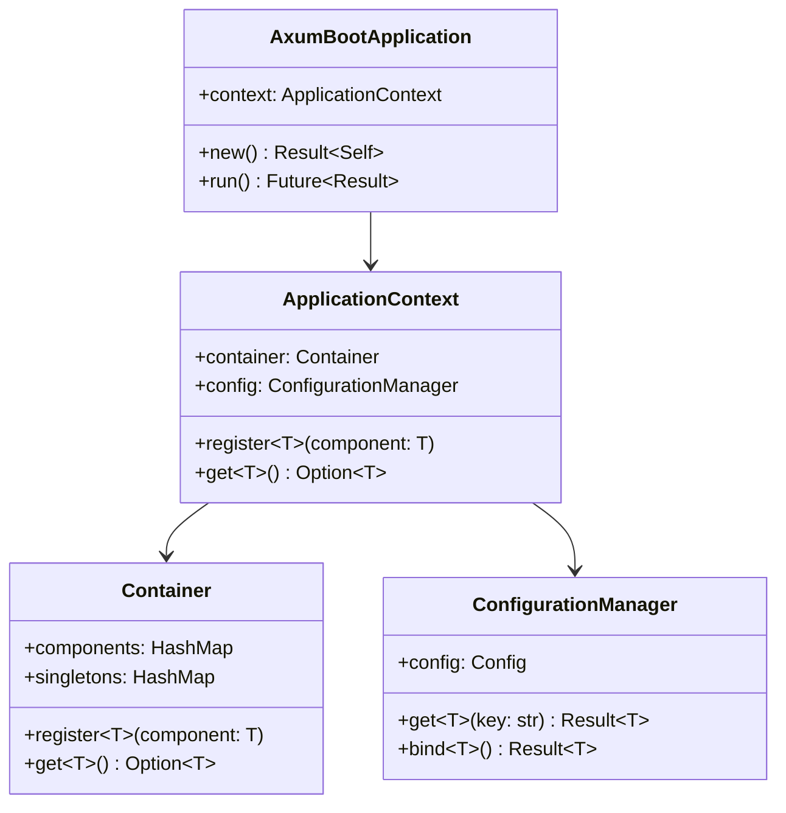

# axum-boot-core

[](https://crates.io/crates/axum-boot-core)
[](https://docs.rs/axum-boot-core)

**axum-boot-core** 是 AxumBoot 框架的核心库，提供了应用启动、配置管理、依赖注入、错误处理等基础功能。

## 🎯 核心功能

- **应用生命周期管理** - 统一的应用启动和关闭流程
- **配置系统** - 支持多格式、多环境的配置管理
- **依赖注入容器** - 类型安全的组件管理和自动装配
- **错误处理** - 统一的错误类型和处理机制
- **日志集成** - 基于 tracing 的结构化日志
- **通用工具** - API 响应格式、分页等实用工具

## 📦 安装

```toml
[dependencies]
axum-boot-core = "0.1.0"
tokio = { version = "1.0", features = ["full"] }
serde = { version = "1.0", features = ["derive"] }
```

## 🚀 快速开始

### 创建应用

```rust
use axum_boot_core::*;

#[axum_boot_application]
pub struct Application;

#[tokio::main]
async fn main() -> Result<()> {
    Application::run().await
}
```

### 配置管理

```rust
// application.toml
[server]
host = "0.0.0.0"
port = 8080

[database]
url = "mysql://localhost:3306/mydb"
max_connections = 10
```

```rust
use axum_boot_core::*;

#[derive(Debug, Clone, Deserialize, Configuration)]
pub struct ServerConfig {
    pub host: String,
    pub port: u16,
}

#[derive(Service)]
pub struct MyService {
    config: ServerConfig,
}

impl MyService {
    pub fn new(config: ServerConfig) -> Self {
        Self { config }
    }
    
    pub fn get_server_addr(&self) -> String {
        format!("{}:{}", self.config.host, self.config.port)
    }
}
```

### 依赖注入

```rust
// 定义服务
#[derive(Service)]
pub struct UserService {
    repository: Arc<UserRepository>,
}

// 定义仓储
#[derive(Repository)]
pub struct UserRepository {
    db_pool: Arc<DbPool>,
}

// 定义控制器
#[derive(RestController)]
pub struct UserController {
    user_service: Arc<UserService>,
}

impl UserController {
    pub async fn get_users(&self) -> Result<ApiResponse<Vec<User>>> {
        let users = self.user_service.get_all_users().await?;
        Ok(ApiResponse::success(users))
    }
}
```

## 🏗️ 架构设计

### 核心组件

```
axum-boot-core/
├── application/          # 应用启动和生命周期
│   ├── context.rs       # 应用上下文
│   └── lifecycle.rs     # 生命周期管理
├── config/              # 配置管理
│   ├── manager.rs       # 配置管理器
│   ├── properties.rs    # 配置属性定义
│   └── validation.rs    # 配置验证
├── container/           # 依赖注入容器
│   ├── registry.rs      # 组件注册
│   ├── injection.rs     # 依赖注入
│   └── lifecycle.rs     # 组件生命周期
├── error/               # 错误处理
│   ├── types.rs        # 错误类型定义
│   └── handler.rs      # 错误处理器
└── logging/            # 日志系统
    └── config.rs       # 日志配置
```

### 类图关系



## 🔧 核心 API

### AxumBootApplication

应用程序主类，负责整个应用的生命周期管理。

```rust
impl AxumBootApplication {
    /// 创建新的应用实例
    /// 
    /// # 错误
    /// 当配置加载失败或初始化错误时返回错误
    pub fn new() -> Result<Self>;
    
    /// 启动应用
    /// 
    /// 执行完整的启动流程：
    /// 1. 加载配置文件
    /// 2. 初始化日志系统  
    /// 3. 创建依赖注入容器
    /// 4. 扫描和注册组件
    /// 5. 执行依赖注入
    /// 6. 启动相关服务
    /// 7. 等待关闭信号
    pub async fn run(&self) -> Result<()>;
    
    /// 获取应用上下文
    pub fn context(&self) -> &ApplicationContext;
}
```

### ApplicationContext

应用上下文，提供全局的组件和配置访问。

```rust
impl ApplicationContext {
    /// 创建新的应用上下文
    pub fn new() -> Result<Self>;
    
    /// 注册组件到容器
    /// 
    /// # 参数
    /// - `component`: 要注册的组件实例
    pub async fn register<T: 'static + Send + Sync>(&self, component: T);
    
    /// 注册单例组件
    pub async fn register_singleton<T: 'static + Send + Sync>(&self, component: T);
    
    /// 获取配置管理器
    pub fn config_manager(&self) -> &ConfigurationManager;
    
    /// 获取依赖注入容器
    pub fn container(&self) -> &Arc<RwLock<Container>>;
}
```

### ConfigurationManager

配置管理器，支持多种配置源和格式。

```rust
impl ConfigurationManager {
    /// 创建配置管理器
    /// 
    /// 自动加载配置文件和环境变量
    pub fn new() -> Result<Self>;
    
    /// 获取配置值
    /// 
    /// # 示例
    /// ```rust
    /// let port: u16 = config.get("server.port")?;
    /// let host: String = config.get("server.host")?;
    /// ```
    pub fn get<T: DeserializeOwned>(&self, key: &str) -> Result<T>;
    
    /// 绑定配置到结构体
    /// 
    /// # 示例
    /// ```rust
    /// let server_config: ServerConfig = config.bind()?;
    /// ```
    pub fn bind<T: Configuration>(&self) -> Result<T>;
    
    /// 获取字符串配置（便捷方法）
    pub fn get_string(&self, key: &str) -> Result<String>;
    
    /// 获取整数配置（便捷方法）  
    pub fn get_int(&self, key: &str) -> Result<i64>;
    
    /// 获取布尔配置（便捷方法）
    pub fn get_bool(&self, key: &str) -> Result<bool>;
}
```

### Container

依赖注入容器，管理组件的注册和获取。

```rust
impl Container {
    /// 创建新的容器实例
    pub fn new() -> Self;
    
    /// 注册组件
    /// 
    /// # 类型参数
    /// - `T`: 组件类型，必须实现 Send + Sync
    /// 
    /// # 示例
    /// ```rust
    /// let mut container = Container::new();
    /// container.register(MyService::new());
    /// ```
    pub fn register<T: 'static + Send + Sync>(&mut self, component: T);
    
    /// 注册单例组件
    /// 
    /// 单例组件在整个应用生命周期内只有一个实例
    pub fn register_singleton<T: 'static + Send + Sync>(&mut self, component: T);
    
    /// 获取组件实例
    /// 
    /// # 返回值
    /// - `Some(&T)`: 组件实例的引用
    /// - `None`: 组件不存在
    pub fn get<T: 'static>(&self) -> Option<&T>;
    
    /// 获取单例组件
    /// 
    /// # 返回值  
    /// - `Some(Arc<T>)`: 组件实例的智能指针
    /// - `None`: 组件不存在
    pub fn get_singleton<T: 'static>(&self) -> Option<Arc<T>>;
    
    /// 检查是否包含指定类型的组件
    pub fn contains<T: 'static>(&self) -> bool;
}
```

## 🏷️ 组件注解

### Component Traits

```rust
/// 基础组件接口
/// 
/// 所有组件都需要实现此接口
pub trait Component: Send + Sync {
    /// 获取组件名称
    /// 
    /// 用于日志记录和调试
    fn component_name(&self) -> &'static str;
}

/// 服务组件标记接口
/// 
/// 用于标记业务逻辑组件
pub trait Service: Component {}

/// 仓储组件标记接口
/// 
/// 用于标记数据访问组件
pub trait Repository: Component {}

/// 控制器组件标记接口
/// 
/// 用于标记 Web 控制器组件
pub trait Controller: Component {}
```

### 注解宏

```rust
/// 标记结构体为组件
/// 
/// 自动实现 Component trait
/// 
/// # 示例
/// ```rust
/// #[derive(Component)]
/// pub struct MyComponent {
///     name: String,
/// }
/// ```
#[derive(Component)]

/// 标记结构体为服务组件
/// 
/// 自动实现 Component 和 Service trait
/// 
/// # 示例
/// ```rust
/// #[derive(Service)]
/// pub struct UserService {
///     repository: Arc<UserRepository>,
/// }
/// ```
#[derive(Service)]

/// 标记结构体为仓储组件
/// 
/// 自动实现 Component 和 Repository trait
#[derive(Repository)]

/// 标记结构体为控制器组件
/// 
/// 自动实现 Component 和 Controller trait
#[derive(RestController)]
```

## ❌ 错误处理

### 错误类型

```rust
/// 统一错误类型
#[derive(thiserror::Error, Debug)]
pub enum Error {
    /// 配置错误
    #[error("配置错误: {0}")]
    Configuration(#[from] config::ConfigError),
    
    /// IO 错误
    #[error("IO 错误: {0}")]
    Io(#[from] std::io::Error),
    
    /// 验证错误
    #[error("验证错误: {message}")]
    Validation { message: String },
    
    /// 业务错误
    #[error("业务错误: {message} (错误码: {code})")]
    Business { message: String, code: String },
    
    /// 资源未找到
    #[error("资源未找到: {resource}")]
    NotFound { resource: String },
    
    /// 未授权访问
    #[error("未授权访问")]
    Unauthorized,
    
    /// 内部服务器错误
    #[error("内部服务器错误: {message}")]
    Internal { message: String },
}
```

### 错误构造方法

```rust
impl Error {
    /// 创建验证错误
    /// 
    /// # 示例
    /// ```rust
    /// if username.is_empty() {
    ///     return Err(Error::validation("用户名不能为空"));
    /// }
    /// ```
    pub fn validation(message: impl Into<String>) -> Self;
    
    /// 创建业务错误
    /// 
    /// # 参数
    /// - `code`: 错误码，用于客户端判断
    /// - `message`: 错误描述
    /// 
    /// # 示例
    /// ```rust
    /// if user_exists {
    ///     return Err(Error::business("USER_EXISTS", "用户已存在"));
    /// }
    /// ```
    pub fn business(code: impl Into<String>, message: impl Into<String>) -> Self;
    
    /// 创建未找到错误
    pub fn not_found(resource: impl Into<String>) -> Self;
    
    /// 创建内部错误
    pub fn internal(message: impl Into<String>) -> Self;
}
```

## 📊 通用类型

### ApiResponse

统一的 API 响应格式。

```rust
/// API 响应结构
#[derive(Debug, Serialize, Deserialize)]
pub struct ApiResponse<T> {
    /// 响应状态码
    pub code: i32,
    /// 响应消息
    pub message: String,
    /// 响应数据
    pub data: Option<T>,
    /// 时间戳
    pub timestamp: i64,
}

impl<T> ApiResponse<T> {
    /// 创建成功响应
    pub fn success(data: T) -> Self;
    
    /// 创建错误响应
    pub fn error(code: i32, message: impl Into<String>) -> ApiResponse<()>;
}
```

**使用示例：**

```rust
// 成功响应
let users = vec![user1, user2];
let response = ApiResponse::success(users);

// 错误响应
let response = ApiResponse::error(404, "用户不存在");

// JSON 输出
{
  "code": 200,
  "message": "success",
  "data": [...],
  "timestamp": 1709875200
}
```

### 分页支持

```rust
/// 分页参数
#[derive(Debug, Serialize, Deserialize)]
pub struct Page {
    /// 页码（从 0 开始）
    pub page: u64,
    /// 页大小
    pub size: u64,
}

/// 分页结果
#[derive(Debug, Serialize, Deserialize)]
pub struct PageResult<T> {
    /// 当前页数据
    pub content: Vec<T>,
    /// 当前页码
    pub page: u64,
    /// 页大小
    pub size: u64,
    /// 总记录数
    pub total: u64,
    /// 总页数
    pub total_pages: u64,
}
```

**使用示例：**

```rust
// 分页查询
pub async fn get_users(&self, page: Page) -> Result<PageResult<User>> {
    let users = self.repository.find_page(page.page, page.size).await?;
    let total = self.repository.count().await?;
    
    Ok(PageResult::new(users, page.page, page.size, total))
}
```

## ⚙️ 配置系统详解

### 支持的配置格式

- **TOML** (推荐)
- **YAML**
- **JSON**

### 配置文件加载顺序

1. `application.{toml|yaml|json}` - 基础配置
2. `application-{profile}.{toml|yaml|json}` - 环境配置
3. 环境变量 (AXUM_BOOT_*)

### 内置配置结构

```rust
/// 服务器配置
#[derive(Debug, Clone, Deserialize, Configuration)]
pub struct ServerConfig {
    #[serde(default = "default_host")]
    pub host: String,
    
    #[serde(default = "default_port")]
    pub port: u16,
    
    #[serde(default = "default_max_connections")]
    pub max_connections: u32,
}

/// 数据库配置
#[derive(Debug, Clone, Deserialize, Configuration)]
pub struct DatabaseConfig {
    pub url: String,
    pub max_connections: u32,
    pub min_connections: u32,
    pub connection_timeout: u64,
}

/// Redis 配置
#[derive(Debug, Clone, Deserialize, Configuration)]
pub struct RedisConfig {
    pub url: String,
    pub pool_size: u32,
    pub connection_timeout: u64,
}

/// 日志配置
#[derive(Debug, Clone, Deserialize, Configuration)]
pub struct LoggingConfig {
    pub level: String,
    pub format: Option<String>,
    pub output: Option<String>,
}
```

## 🔧 开发工具

### 调试日志

```rust
// 启用容器调试日志
export RUST_LOG="axum_boot_core::container=debug"

// 启用所有调试日志
export RUST_LOG="axum_boot_core=debug"
```

### 配置验证

```rust
use validator::{Validate, ValidationError};

#[derive(Debug, Deserialize, Validate, Configuration)]
pub struct AppConfig {
    #[validate(length(min = 1, max = 50))]
    pub name: String,
    
    #[validate(range(min = 1, max = 65535))]
    pub port: u16,
    
    #[validate(url)]
    pub database_url: String,
}
```

### 环境变量映射

| 配置路径 | 环境变量 | 示例值 |
|----------|----------|--------|
| `server.port` | `AXUM_BOOT_SERVER_PORT` | `8080` |
| `server.host` | `AXUM_BOOT_SERVER_HOST` | `0.0.0.0` |
| `database.url` | `AXUM_BOOT_DATABASE_URL` | `mysql://localhost:3306/db` |
| `database.max_connections` | `AXUM_BOOT_DATABASE_MAX_CONNECTIONS` | `10` |

## 🧪 测试支持

### 测试工具

```rust
#[cfg(test)]
mod tests {
    use super::*;
    use axum_boot_core::test_utils::*;
    
    #[tokio::test]
    async fn test_application_startup() {
        let app = TestApplicationBuilder::new()
            .with_config("test-config.toml")
            .build()
            .await
            .unwrap();
            
        assert!(app.is_running());
    }
    
    #[test]
    fn test_config_binding() {
        let config = TestConfig::from_str(r#"
            [server]
            host = "localhost"
            port = 3000
        "#).unwrap();
        
        let server_config: ServerConfig = config.bind().unwrap();
        assert_eq!(server_config.host, "localhost");
        assert_eq!(server_config.port, 3000);
    }
}
```

## 📈 性能特性

- **零成本抽象** - 编译时优化，运行时无额外开销
- **内存安全** - Rust 的编译期安全保证
- **异步优先** - 基于 tokio 的高并发处理
- **延迟初始化** - 组件按需创建和初始化

## 🚀 最佳实践

### 组件设计

```rust
// ✅ 好的实践
#[derive(Service)]
pub struct UserService {
    repository: Arc<dyn UserRepository>,  // 依赖接口
    logger: Arc<dyn Logger>,
}

impl UserService {
    /// 构造函数注入依赖
    pub fn new(
        repository: Arc<dyn UserRepository>,
        logger: Arc<dyn Logger>,
    ) -> Self {
        Self { repository, logger }
    }
    
    /// 业务方法包含适当的错误处理
    pub async fn create_user(&self, request: CreateUserRequest) -> Result<User> {
        // 输入验证
        self.validate_request(&request)?;
        
        // 业务逻辑
        let user = User::from(request);
        
        // 数据持久化
        self.repository.save(user).await
            .map_err(|e| Error::internal(format!("保存用户失败: {}", e)))
    }
}
```

### 错误处理

```rust
// ✅ 统一的错误处理
impl UserService {
    pub async fn get_user(&self, id: u64) -> Result<User> {
        // 参数验证
        if id == 0 {
            return Err(Error::validation("用户 ID 不能为 0"));
        }
        
        // 业务查询
        self.repository.find_by_id(id).await?
            .ok_or_else(|| Error::not_found("用户"))
    }
}

// ✅ 控制器错误转换
impl UserController {
    pub async fn get_user(&self, id: u64) -> Result<ApiResponse<User>> {
        match self.user_service.get_user(id).await {
            Ok(user) => Ok(ApiResponse::success(user)),
            Err(Error::Validation { message }) => {
                Ok(ApiResponse::error(400, message))
            },
            Err(Error::NotFound { resource }) => {
                Ok(ApiResponse::error(404, format!("{} 不存在", resource)))
            },
            Err(e) => {
                tracing::error!("获取用户失败: {}", e);
                Ok(ApiResponse::error(500, "内部服务器错误"))
            }
        }
    }
}
```

## 🔗 相关链接

- [完整 API 文档](../../api/core.md)
- [配置系统指南](../../guide/configuration.md)
- [依赖注入指南](../../guide/dependency-injection.md)
- [错误处理指南](../../guide/error-handling.md)
- [GitHub 仓库](https://github.com/axumboot/axum-boot)
- [示例代码](../../examples/)