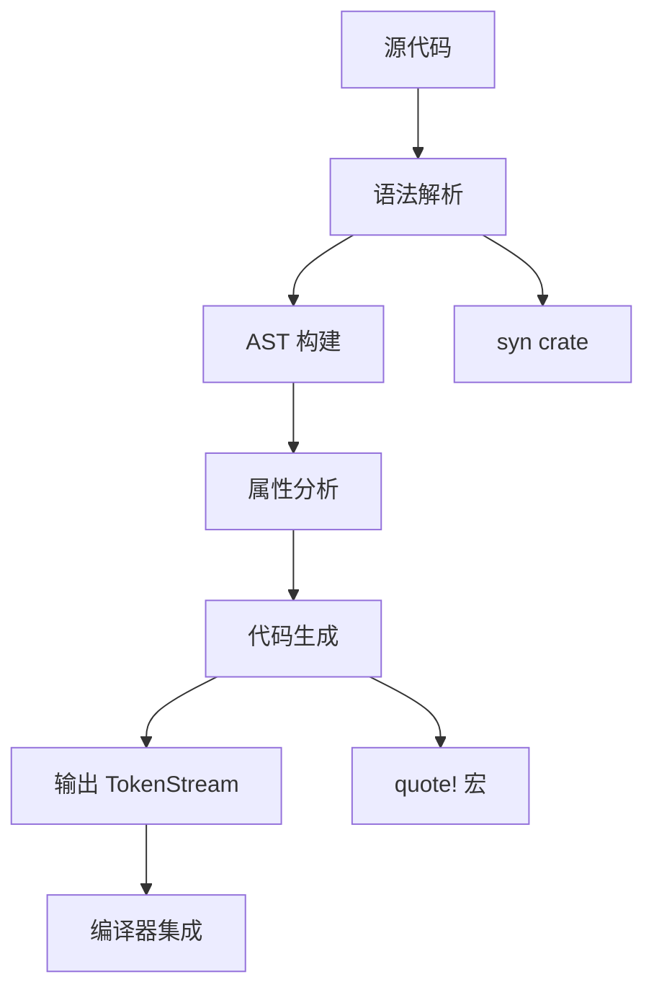

# axum-boot-macro

[](https://crates.io/crates/axum-boot-macro)
[](https://docs.rs/axum-boot-macro)

**axum-boot-macro** 是 AxumBoot 框架的宏系统，提供了类似 Spring Boot 的注解式编程体验。通过过程宏（proc-macro）实现编译时代码生成，为 Rust 带来声明式的组件开发模式。

## 🎯 核心功能

- **应用启动注解** - `#[axum_boot_application]` 应用入口标记
- **组件注解** - `#[Component]`, `#[Service]`, `#[Repository]` 组件标记
- **Web 注解** - `#[RestController]`, HTTP 方法注解（开发中）
- **依赖注入注解** - `#[Autowired]`, `#[Bean]`（开发中）
- **数据映射注解** - `#[Entity]`, `#[Table]`, `#[Column]`（开发中）
- **横切关注点注解** - `#[Transactional]`, `#[Cacheable]`（开发中）

## 📦 安装

```toml
[dependencies]
axum-boot-macro = "0.1.0"
# 通常与 axum-boot-core 一起使用
axum-boot-core = "0.1.0"
```

## 🚀 快速开始

### 应用启动注解

```rust
use axum_boot_core::*;

/// 标记应用程序入口
#[axum_boot_application]
pub struct MyApplication;

#[tokio::main]
async fn main() -> Result<()> {
    // 自动生成的 run() 方法
    MyApplication::run().await
}
```

### 组件注解

```rust
use axum_boot_core::*;

/// 通用组件
#[derive(Component)]
pub struct ConfigService {
    settings: HashMap<String, String>,
}

/// 服务层组件
#[derive(Service)]
pub struct UserService {
    repository: Arc<UserRepository>,
}

/// 数据访问层组件
#[derive(Repository)]
pub struct UserRepository {
    db_pool: Arc<DbPool>,
}

/// Web 控制器组件
#[derive(RestController)]
pub struct UserController {
    user_service: Arc<UserService>,
}
```

## 🏷️ 注解详解

### 1. 应用启动注解

#### `#[axum_boot_application]`

标记结构体为 AxumBoot 应用入口点。

**功能：**
- 生成 `run()` 静态方法
- 初始化应用上下文
- 启动完整的应用生命周期

**生成的代码：**
```rust
// 原始代码
#[axum_boot_application]
pub struct Application;

// 宏展开后
pub struct Application;

impl Application {
    pub async fn run() -> axum_boot_core::Result<()> {
        let app = axum_boot_core::AxumBootApplication::new()?;
        app.run().await
    }
}
```

**使用示例：**
```rust
#[axum_boot_application]
pub struct MyApp;

#[tokio::main]
async fn main() -> Result<()> {
    // 启动应用
    MyApp::run().await
}
```

### 2. 组件注解

#### `#[derive(Component)]`

标记结构体为可注入的组件。

**功能：**
- 实现 `Component` trait
- 提供组件名称
- 支持依赖注入

**生成的代码：**
```rust
// 原始代码
#[derive(Component)]
pub struct MyComponent {
    name: String,
}

// 宏展开后
pub struct MyComponent {
    name: String,
}

impl axum_boot_core::Component for MyComponent {
    fn component_name(&self) -> &'static str {
        "MyComponent"
    }
}
```

#### `#[derive(Service)]`

标记结构体为服务层组件。

**功能：**
- 实现 `Component` 和 `Service` trait
- 标记为业务逻辑组件
- 支持事务、缓存等横切关注点

**生成的代码：**
```rust
// 原始代码  
#[derive(Service)]
pub struct UserService {
    repository: Arc<UserRepository>,
}

// 宏展开后
impl axum_boot_core::Component for UserService {
    fn component_name(&self) -> &'static str {
        "UserService"
    }
}

impl axum_boot_core::Service for UserService {}
```

#### `#[derive(Repository)]`

标记结构体为数据访问层组件。

**功能：**
- 实现 `Component` 和 `Repository` trait
- 标记为数据访问组件
- 支持事务管理

#### `#[derive(RestController)]`

标记结构体为 REST 控制器组件。

**功能：**
- 实现 `Component` 和 `Controller` trait
- 标记为 Web 控制器组件
- 支持路由注册（开发中）

### 3. Web 注解（开发中）

#### 路由映射注解

```rust
#[derive(RestController)]
#[RequestMapping("/api/users")]  // 控制器基础路径
pub struct UserController {
    user_service: Arc<UserService>,
}

impl UserController {
    #[GetMapping("/{id}")]  // GET /api/users/{id}
    pub async fn get_user(&self, #[PathVariable] id: u64) -> Result<ApiResponse<User>> {
        // 实现逻辑
    }
    
    #[PostMapping]  // POST /api/users
    pub async fn create_user(&self, #[RequestBody] user: CreateUserRequest) -> Result<ApiResponse<User>> {
        // 实现逻辑
    }
    
    #[PutMapping("/{id}")]  // PUT /api/users/{id}
    pub async fn update_user(
        &self,
        #[PathVariable] id: u64,
        #[RequestBody] user: UpdateUserRequest
    ) -> Result<ApiResponse<User>> {
        // 实现逻辑
    }
    
    #[DeleteMapping("/{id}")]  // DELETE /api/users/{id}
    pub async fn delete_user(&self, #[PathVariable] id: u64) -> Result<ApiResponse<()>> {
        // 实现逻辑
    }
}
```

#### 参数绑定注解

```rust
impl UserController {
    #[GetMapping("/search")]
    pub async fn search_users(
        &self,
        #[RequestParam] name: Option<String>,           // 查询参数 ?name=xxx
        #[RequestParam] age: Option<u32>,               // 查询参数 ?age=xxx  
        #[RequestHeader] authorization: Option<String>, // 请求头
    ) -> Result<ApiResponse<Vec<User>>> {
        // 实现搜索逻辑
    }
}
```

### 4. 依赖注入注解（开发中）

#### `#[Autowired]`

自动注入依赖。

```rust
#[derive(Service)]
pub struct OrderService {
    #[Autowired]
    user_service: Arc<UserService>,
    
    #[Autowired]  
    payment_service: Arc<PaymentService>,
    
    #[Autowired]
    notification_service: Arc<dyn NotificationService>,
}
```

#### `#[Bean]`

定义 Bean 工厂方法。

```rust
#[derive(Configuration)]
pub struct AppConfiguration;

impl AppConfiguration {
    #[Bean]
    pub fn redis_client(&self, config: RedisConfig) -> RedisClient {
        RedisClient::new(&config.url).expect("Failed to create Redis client")
    }
    
    #[Bean]
    #[ConditionalOnProperty(name = "email.enabled", value = "true")]
    pub fn email_service(&self, config: EmailConfig) -> Box<dyn EmailService> {
        Box::new(SmtpEmailService::new(config))
    }
}
```

### 5. 数据映射注解（开发中）

#### `#[Entity]`

标记结构体为数据库实体。

```rust
#[derive(Entity, Debug, Serialize, Deserialize)]
#[table(name = "users")]
pub struct User {
    #[id]
    #[column(name = "id")]
    pub id: u64,
    
    #[column(name = "username", unique = true)]
    pub username: String,
    
    #[column(name = "email", unique = true)]
    pub email: String,
    
    #[column(name = "created_at")]
    pub created_at: chrono::DateTime<chrono::Utc>,
    
    #[column(name = "updated_at")]
    pub updated_at: Option<chrono::DateTime<chrono::Utc>>,
}
```

#### `#[Table]`

定义表映射信息。

```rust
#[derive(Entity)]
#[table(name = "user_profiles", schema = "public")]
pub struct UserProfile {
    #[id]
    pub id: u64,
    
    #[foreign_key(table = "users", column = "id")]
    pub user_id: u64,
    
    pub first_name: String,
    pub last_name: String,
}
```

### 6. 横切关注点注解（开发中）

#### `#[Transactional]`

声明式事务管理。

```rust
#[derive(Service)]
pub struct UserService {
    repository: Arc<UserRepository>,
}

impl UserService {
    #[Transactional]
    pub async fn create_user_with_profile(&self, request: CreateUserRequest) -> Result<User> {
        // 这个方法中的所有数据库操作都在同一个事务中
        let user = self.repository.save_user(request.into()).await?;
        let profile = UserProfile::new(user.id, request.profile);
        self.repository.save_profile(profile).await?;
        Ok(user)
    }
    
    #[Transactional(propagation = "REQUIRES_NEW")]
    pub async fn audit_user_action(&self, action: UserAction) -> Result<()> {
        // 在新事务中执行，不受外层事务影响
        self.repository.save_audit(action).await
    }
}
```

#### `#[Cacheable]`

声明式缓存。

```rust
#[derive(Service)]
pub struct UserService {
    repository: Arc<UserRepository>,
}

impl UserService {
    #[Cacheable(key = "user::{id}", ttl = "1h")]
    pub async fn get_user_by_id(&self, id: u64) -> Result<Option<User>> {
        // 结果会自动缓存1小时
        self.repository.find_by_id(id).await
    }
    
    #[CacheEvict(key = "user::{user.id}")]
    pub async fn update_user(&self, user: User) -> Result<User> {
        // 更新后清除缓存
        self.repository.update(user).await
    }
}
```

#### `#[LogExecutionTime]`

记录方法执行时间。

```rust
#[derive(Service)]
pub struct ReportService {
    data_service: Arc<DataService>,
}

impl ReportService {
    #[LogExecutionTime]
    #[LogArgs]  // 同时记录参数
    pub async fn generate_monthly_report(&self, year: i32, month: u32) -> Result<Report> {
        // 自动记录执行时间和参数
        self.data_service.aggregate_monthly_data(year, month).await
    }
}
```

## 🔧 宏实现原理

### 代码生成流程



### 核心依赖

```toml
[dependencies]
proc-macro2 = "1.0"    # 过程宏基础设施
quote = "1.0"          # 代码生成
syn = "2.0"            # Rust 语法解析
```

### 实现示例

```rust
use proc_macro::TokenStream;
use quote::quote;
use syn::{parse_macro_input, DeriveInput, Data, Fields};

#[proc_macro_derive(Service)]
pub fn service_derive(input: TokenStream) -> TokenStream {
    let input = parse_macro_input!(input as DeriveInput);
    let name = &input.ident;
    
    // 生成 Component trait 实现
    let component_impl = quote! {
        impl axum_boot_core::Component for #name {
            fn component_name(&self) -> &'static str {
                stringify!(#name)
            }
        }
    };
    
    // 生成 Service trait 实现
    let service_impl = quote! {
        impl axum_boot_core::Service for #name {}
    };
    
    // 组合生成的代码
    let expanded = quote! {
        #component_impl
        #service_impl
    };
    
    TokenStream::from(expanded)
}
```

## 🧪 测试宏展开

### 使用 cargo-expand

```bash
# 安装 cargo-expand
cargo install cargo-expand

# 查看宏展开结果
cargo expand --lib

# 查看特定模块的展开
cargo expand --lib my_module
```

### 展开示例

**原始代码：**
```rust
#[derive(Service)]
pub struct UserService {
    repository: Arc<UserRepository>,
}
```

**展开后：**
```rust
pub struct UserService {
    repository: Arc<UserRepository>,
}

impl axum_boot_core::Component for UserService {
    fn component_name(&self) -> &'static str {
        "UserService"
    }
}

impl axum_boot_core::Service for UserService {}
```

## ⚠️ 注意事项

### 宏使用限制

1. **导入要求**
```rust
// 必须导入相关 trait
use axum_boot_core::{Component, Service, Repository};

#[derive(Service)]
pub struct MyService;
```

2. **结构体要求**
```rust
// ✅ 支持的结构体
#[derive(Service)]
pub struct UserService {
    field: String,
}

// ❌ 不支持的结构体
#[derive(Service)]
pub struct TupleService(String);  // 元组结构体

#[derive(Service)]  
pub enum ServiceEnum {  // 枚举
    Variant,
}
```

3. **可见性要求**
```rust
// ✅ 公开结构体
#[derive(Service)]
pub struct PublicService;

// ✅ 私有结构体（在模块内使用）
#[derive(Service)]
struct PrivateService;
```

### 编译时错误

常见的宏编译错误和解决方案：

```rust
// ❌ 错误：缺少必要的 trait 导入
#[derive(Service)]
pub struct MyService;
// error: cannot find trait `Component` in this scope

// ✅ 正确：导入所需 trait
use axum_boot_core::{Component, Service};

#[derive(Service)]
pub struct MyService;
```

### 调试技巧

1. **检查宏展开**
```bash
cargo expand | grep -A 20 "impl.*Component.*for.*MyService"
```

2. **启用宏调试**
```rust
// 在 Cargo.toml 中
[dependencies]
axum-boot-macro = { version = "0.1.0", features = ["debug"] }
```

3. **编译时日志**
```bash
RUST_LOG=axum_boot_macro=debug cargo build
```

## 🚀 最佳实践

### 组件命名

```rust
// ✅ 好的命名
#[derive(Service)]
pub struct UserService;        // 服务：XxxService

#[derive(Repository)]  
pub struct UserRepository;     // 仓储：XxxRepository

#[derive(RestController)]
pub struct UserController;     // 控制器：XxxController

#[derive(Component)]
pub struct EmailSender;        // 组件：功能性名称
```

### 依赖组织

```rust
// ✅ 推荐的依赖组织方式
#[derive(Service)]
pub struct OrderService {
    // 依赖接口而不是实现
    user_service: Arc<dyn UserService>,
    payment_service: Arc<dyn PaymentService>,
    
    // 配置注入
    config: OrderConfig,
}
```

### 错误处理

```rust
#[derive(Service)]
pub struct UserService {
    repository: Arc<UserRepository>,
}

impl UserService {
    /// 服务方法应该返回 Result 类型
    pub async fn create_user(&self, request: CreateUserRequest) -> Result<User> {
        // 输入验证
        if request.email.is_empty() {
            return Err(Error::validation("邮箱不能为空"));
        }
        
        // 业务逻辑
        let user = User::from(request);
        
        // 委托给仓储层
        self.repository.save(user).await
    }
}
```

## 🔮 未来计划

### 即将推出的注解

1. **完整的 Web 注解**
   - `#[RequestMapping]`, `#[GetMapping]` 等 HTTP 方法注解
   - `#[PathVariable]`, `#[RequestParam]`, `#[RequestBody]` 参数绑定
   - `#[ResponseStatus]`, `#[ResponseBody]` 响应处理

2. **高级依赖注入**
   - `#[Autowired]` 自动注入
   - `#[Qualifier]` 限定符
   - `#[ConditionalOnProperty]` 条件装配

3. **数据访问注解**
   - `#[Entity]`, `#[Table]`, `#[Column]` 实体映射
   - `#[Query]`, `#[Modifying]` 查询方法
   - `#[Transactional]` 事务管理

4. **AOP 支持**
   - `#[Aspect]` 切面定义
   - `#[Before]`, `#[After]`, `#[Around]` 通知
   - `#[Pointcut]` 切点表达式

### 性能优化计划

- 编译时预计算
- 更智能的代码生成
- 减少生成代码大小
- 改进错误消息

## 🔗 相关链接

- [axum-boot-core 文档](./axum-boot-core.md)
- [快速开始指南](../guide/quick-start.md)
- [核心概念](../guide/core-concepts.md)
- [GitHub 仓库](https://github.com/axumboot/axum-boot)
- [示例代码](../examples/)