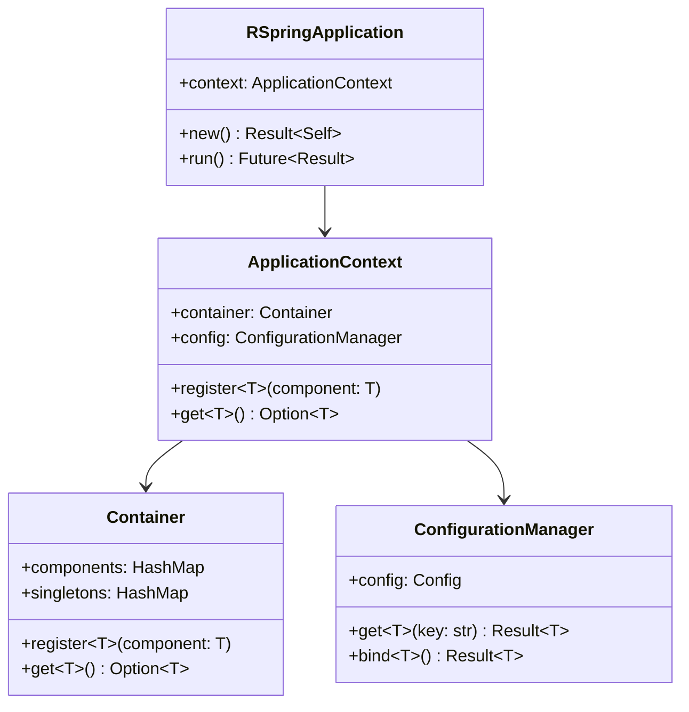

# rspring-core

[](https://crates.io/crates/rspring-core)
[](https://docs.rs/rspring-core)

**rspring-core** 是 RSpring 框架的核心库，提供了应用启动、配置管理、依赖注入、错误处理和日志系统等基础功能。

## 🎯 核心功能

- **应用生命周期管理** - 统一的应用启动和关闭流程
- **通用配置系统** - 支持 TOML/YAML/JSON 的通用配置读取工具
- **依赖注入容器** - 类型安全的组件管理和自动装配
- **核心错误处理** - 统一的错误类型和处理机制
- **日志集成** - 基于 tracing 的结构化日志
- **核心组件注解** - 基础的组件标记宏（Component, Service, Repository）

## 📦 安装

```toml
[dependencies]
rspring-core = "0.1.0"
tokio = { version = "1.0", features = ["full"] }
serde = { version = "1.0", features = ["derive"] }
```

## 🚀 快速开始

### 创建纯核心应用

```rust
use rspring_core::*;

#[rspring_application]
pub struct Application;

#[tokio::main]
async fn main() -> Result<()> {
    Application::run().await
}
```

### 配置管理

```rust
// application.toml
[app]
name = "My Application"
version = "1.0.0"
debug = true

[server]
host = "0.0.0.0"
port = 8080

[custom]
max_workers = 10
timeout = 30
features = ["auth", "logging"]

[database]
type = "mysql"
connections = { min = 5, max = 20 }
```

```rust
use rspring_core::*;

// 定义自定义配置结构
#[derive(Debug, Clone, Deserialize)]
pub struct AppConfig {
    pub name: String,
    pub version: String,
    pub debug: bool,
}

#[derive(Debug, Clone, Deserialize)]
pub struct ServerConfig {
    pub host: String,
    pub port: u16,
}

#[derive(Debug, Clone, Deserialize)]
pub struct CustomConfig {
    pub max_workers: u32,
    pub timeout: u64,
    pub features: Vec<String>,
}

#[derive(Service)]
pub struct ConfigService {
    config_manager: Arc<ConfigurationManager>,
}

impl ConfigService {
    pub fn new(config_manager: Arc<ConfigurationManager>) -> Self {
        Self { config_manager }
    }
    
    // 读取完整配置结构
    pub fn get_app_config(&self) -> Result<AppConfig> {
        self.config_manager.get_section("app")
    }
    
    pub fn get_server_config(&self) -> Result<ServerConfig> {
        self.config_manager.get_section("server")
    }
    
    // 读取单个配置值
    pub fn get_port(&self) -> Result<u16> {
        self.config_manager.get("server.port")
    }
    
    pub fn get_features(&self) -> Result<Vec<String>> {
        self.config_manager.get("custom.features")
    }
}
```

### 依赖注入（纯核心组件）

```rust
// 定义业务服务
#[derive(Service)]
pub struct UserService {
    repository: Arc<UserRepository>,
    config: Arc<ConfigurationManager>,
}

impl UserService {
    pub fn new(repository: Arc<UserRepository>, config: Arc<ConfigurationManager>) -> Self {
        Self { repository, config }
    }
    
    pub async fn get_all_users(&self) -> Result<Vec<User>> {
        // 使用配置
        let page_size: u32 = self.config.get("pagination.default_size")?;
        self.repository.find_all_with_limit(page_size).await
    }
}

// 定义数据访问层
#[derive(Repository)]
pub struct UserRepository;

impl UserRepository {
    pub async fn find_all_with_limit(&self, limit: u32) -> Result<Vec<User>> {
        // 实际的数据访问逻辑在对应的 data 模块中实现
        todo!("由具体的 data 模块实现")
    }
}

// 定义通用组件
#[derive(Component)]
pub struct EmailService {
    config: Arc<ConfigurationManager>,
}

impl EmailService {
    pub fn new(config: Arc<ConfigurationManager>) -> Self {
        Self { config }
    }
    
    pub async fn send_email(&self, to: &str, subject: &str) -> Result<()> {
        // 读取邮件配置
        let smtp_host: String = self.config.get("email.smtp.host")?;
        let smtp_port: u16 = self.config.get("email.smtp.port")?;
        
        // 发送邮件逻辑...
        println!("发送邮件到 {} 通过 {}:{}", to, smtp_host, smtp_port);
        Ok(())
    }
}
```

## 🏗️ 架构设计

### 核心组件

```
rspring-core/
├── application/          # 应用启动和生命周期
│   ├── context.rs       # 应用上下文
│   └── lifecycle.rs     # 生命周期管理
├── config/              # 配置管理
│   ├── manager.rs       # 配置管理器
│   ├── properties.rs    # 配置属性定义
│   └── validation.rs    # 配置验证
├── container/           # 依赖注入容器
│   ├── registry.rs      # 组件注册
│   ├── injection.rs     # 依赖注入
│   └── lifecycle.rs     # 组件生命周期
├── error/               # 错误处理（核心错误类型）
│   ├── types.rs        # 错误类型定义
│   └── handler.rs      # 错误处理器
├── logging/            # 日志系统
│   └── config.rs       # 日志配置
└── macros.rs           # 核心宏（Service, Repository, Component）
```

### 类图关系



## 🔧 核心 API

### RSpringApplication

应用程序主类，负责整个应用的生命周期管理。

```rust
impl RSpringApplication {
    /// 创建新的应用实例
    /// 
    /// # 错误
    /// 当配置加载失败或初始化错误时返回错误
    pub fn new() -> Result<Self>;
    
    /// 启动应用
    /// 
    /// 执行完整的启动流程：
    /// 1. 加载配置文件
    /// 2. 初始化日志系统  
    /// 3. 创建依赖注入容器
    /// 4. 扫描和注册组件
    /// 5. 执行依赖注入
    /// 6. 启动相关服务
    /// 7. 等待关闭信号
    pub async fn run(&self) -> Result<()>;
    
    /// 获取应用上下文
    pub fn context(&self) -> &ApplicationContext;
}
```

### ApplicationContext

应用上下文，提供全局的组件和配置访问。

```rust
impl ApplicationContext {
    /// 创建新的应用上下文
    pub fn new() -> Result<Self>;
    
    /// 注册组件到容器
    /// 
    /// # 参数
    /// - `component`: 要注册的组件实例
    pub async fn register<T: 'static + Send + Sync>(&self, component: T);
    
    /// 注册单例组件
    pub async fn register_singleton<T: 'static + Send + Sync>(&self, component: T);
    
    /// 获取配置管理器
    pub fn config_manager(&self) -> &ConfigurationManager;
    
    /// 获取依赖注入容器
    pub fn container(&self) -> &Arc<RwLock<Container>>;
}
```

### ConfigurationManager

通用配置读取工具，支持 TOML、YAML、JSON 格式的复杂配置结构。

```rust
impl ConfigurationManager {
    /// 创建配置管理器
    /// 
    /// 自动加载配置文件和环境变量
    pub fn new() -> Result<Self>;
    
    /// 获取单个配置值
    /// 
    /// 支持所有 serde 反序列化类型，包括：
    /// - 基础类型：String, i32, u64, bool 等
    /// - 集合类型：Vec<T>, HashMap<K, V>
    /// - 可选类型：Option<T>
    /// - 自定义结构体
    /// 
    /// # 示例
    /// ```rust
    /// // 基础类型
    /// let port: u16 = config.get("server.port")?;
    /// let debug: bool = config.get("app.debug")?;
    /// 
    /// // 集合类型
    /// let features: Vec<String> = config.get("custom.features")?;
    /// 
    /// // 复杂结构
    /// let db_config: HashMap<String, i32> = config.get("database.connections")?;
    /// ```
    pub fn get<T: DeserializeOwned>(&self, key: &str) -> Result<T>;
    
    /// 获取配置章节
    /// 
    /// 将整个配置章节绑定到结构体
    /// 
    /// # 示例
    /// ```rust
    /// #[derive(Deserialize)]
    /// pub struct ServerConfig {
    ///     pub host: String,
    ///     pub port: u16,
    /// }
    /// 
    /// let server: ServerConfig = config.get_section("server")?;
    /// ```
    pub fn get_section<T: DeserializeOwned>(&self, section: &str) -> Result<T>;
    
    /// 获取整个配置文件
    /// 
    /// 将整个配置文件绑定到结构体
    pub fn get_all<T: DeserializeOwned>(&self) -> Result<T>;
    
    /// 检查配置项是否存在
    pub fn contains_key(&self, key: &str) -> bool;
    
    /// 获取所有配置键
    pub fn keys(&self) -> Vec<String>;
    
    /// 获取指定前缀的所有配置键
    /// 
    /// # 示例
    /// ```rust
    /// // 获取所有 "database." 开头的配置
    /// let db_keys = config.keys_with_prefix("database");
    /// ```
    pub fn keys_with_prefix(&self, prefix: &str) -> Vec<String>;
}
```

### Container

依赖注入容器，管理组件的注册和获取。

```rust
impl Container {
    /// 创建新的容器实例
    pub fn new() -> Self;
    
    /// 注册组件
    /// 
    /// # 类型参数
    /// - `T`: 组件类型，必须实现 Send + Sync
    /// 
    /// # 示例
    /// ```rust
    /// let mut container = Container::new();
    /// container.register(MyService::new());
    /// ```
    pub fn register<T: 'static + Send + Sync>(&mut self, component: T);
    
    /// 注册单例组件
    /// 
    /// 单例组件在整个应用生命周期内只有一个实例
    pub fn register_singleton<T: 'static + Send + Sync>(&mut self, component: T);
    
    /// 获取组件实例
    /// 
    /// # 返回值
    /// - `Some(&T)`: 组件实例的引用
    /// - `None`: 组件不存在
    pub fn get<T: 'static>(&self) -> Option<&T>;
    
    /// 获取单例组件
    /// 
    /// # 返回值  
    /// - `Some(Arc<T>)`: 组件实例的智能指针
    /// - `None`: 组件不存在
    pub fn get_singleton<T: 'static>(&self) -> Option<Arc<T>>;
    
    /// 检查是否包含指定类型的组件
    pub fn contains<T: 'static>(&self) -> bool;
}
```

## 🏷️ 组件注解

### Component Traits

```rust
/// 基础组件接口
/// 
/// 所有组件都需要实现此接口
pub trait Component: Send + Sync {
    /// 获取组件名称
    /// 
    /// 用于日志记录和调试
    fn component_name(&self) -> &'static str;
}

/// 服务组件标记接口
/// 
/// 用于标记业务逻辑组件
pub trait Service: Component {}

/// 仓储组件标记接口
/// 
/// 用于标记数据访问组件
pub trait Repository: Component {}

/// 控制器组件标记接口
/// 
/// 基础的控制器标记，具体 Web 功能由其他模块提供
pub trait Controller: Component {}
```

### 注解宏（核心宏）

```rust
/// 标记结构体为组件
/// 
/// 自动实现 Component trait
/// 
/// # 示例
/// ```rust
/// #[derive(Component)]
/// pub struct MyComponent {
///     name: String,
/// }
/// ```
#[derive(Component)]

/// 标记结构体为服务组件
/// 
/// 自动实现 Component 和 Service trait
/// 
/// # 示例
/// ```rust
/// #[derive(Service)]
/// pub struct UserService {
///     repository: Arc<UserRepository>,
/// }
/// ```
#[derive(Service)]

/// 标记结构体为仓储组件
/// 
/// 自动实现 Component 和 Repository trait
#[derive(Repository)]

/// 标记结构体为应用程序入口
/// 
/// 自动生成 run() 方法用于启动应用
/// 
/// # 示例
/// ```rust
/// #[rspring_application]
/// pub struct Application;
/// 
/// #[tokio::main]
/// async fn main() -> Result<()> {
///     Application::run().await
/// }
/// ```
#[rspring_application]
```

## ❌ 错误处理

### 错误类型

```rust
/// 统一错误类型
#[derive(thiserror::Error, Debug)]
pub enum Error {
    /// 配置错误
    #[error("配置错误: {0}")]
    Configuration(#[from] config::ConfigError),
    
    /// IO 错误
    #[error("IO 错误: {0}")]
    Io(#[from] std::io::Error),
    
    /// 验证错误
    #[error("验证错误: {message}")]
    Validation { message: String },
    
    /// 业务错误
    #[error("业务错误: {message} (错误码: {code})")]
    Business { message: String, code: String },
    
    /// 资源未找到
    #[error("资源未找到: {resource}")]
    NotFound { resource: String },
    
    /// 未授权访问
    #[error("未授权访问")]
    Unauthorized,
    
    /// 内部服务器错误
    #[error("内部服务器错误: {message}")]
    Internal { message: String },
}
```

### 错误构造方法

```rust
impl Error {
    /// 创建验证错误
    /// 
    /// # 示例
    /// ```rust
    /// if username.is_empty() {
    ///     return Err(Error::validation("用户名不能为空"));
    /// }
    /// ```
    pub fn validation(message: impl Into<String>) -> Self;
    
    /// 创建业务错误
    /// 
    /// # 参数
    /// - `code`: 错误码，用于客户端判断
    /// - `message`: 错误描述
    /// 
    /// # 示例
    /// ```rust
    /// if user_exists {
    ///     return Err(Error::business("USER_EXISTS", "用户已存在"));
    /// }
    /// ```
    pub fn business(code: impl Into<String>, message: impl Into<String>) -> Self;
    
    /// 创建未找到错误
    pub fn not_found(resource: impl Into<String>) -> Self;
    
    /// 创建内部错误
    pub fn internal(message: impl Into<String>) -> Self;
}
```

## ⚙️ 配置系统详解

### 支持的配置格式

- **TOML** (推荐) - 简洁易读，支持复杂结构
- **YAML** - 灵活的层次结构
- **JSON** - 通用数据交换格式

### 配置文件加载顺序

1. `application.{toml|yaml|json}` - 基础配置
2. `application-{profile}.{toml|yaml|json}` - 环境配置
3. 环境变量 (RSPRING_*)

### 支持的数据类型

#### 基础类型
```toml
# application.toml
app_name = "My App"          # String
port = 8080                  # 整数
debug = true                 # 布尔
version = 1.5                # 浮点数
```

```rust
let name: String = config.get("app_name")?;
let port: u16 = config.get("port")?;
let debug: bool = config.get("debug")?;
let version: f32 = config.get("version")?;
```

#### 数组和列表
```toml
features = ["auth", "logging", "cache"]
ports = [8080, 8081, 8082]
```

```rust
let features: Vec<String> = config.get("features")?;
let ports: Vec<u16> = config.get("ports")?;
```

#### 对象和映射
```toml
[database]
host = "localhost"
port = 3306
name = "mydb"

[limits]
max_connections = 100
timeout = 30

[features]
auth = { enabled = true, provider = "jwt" }
logging = { level = "info", format = "json" }
```

```rust
// 定义结构体
#[derive(Debug, Deserialize)]
pub struct DatabaseConfig {
    pub host: String,
    pub port: u16,
    pub name: String,
}

#[derive(Debug, Deserialize)]
pub struct AuthConfig {
    pub enabled: bool,
    pub provider: String,
}

// 读取配置
let db_config: DatabaseConfig = config.get_section("database")?;
let limits: HashMap<String, u32> = config.get_section("limits")?;
let auth_config: AuthConfig = config.get("features.auth")?;
```

#### 可选值和默认值
```toml
[optional]
# timeout 可能不存在
# timeout = 30
```

```rust
#[derive(Debug, Deserialize)]
pub struct OptionalConfig {
    #[serde(default = "default_timeout")]
    pub timeout: u32,
    pub max_retry: Option<u32>,  // 可为 None
}

fn default_timeout() -> u32 { 30 }

let opt_config: OptionalConfig = config.get_section("optional")?;
```

### 复杂配置示例

```toml
# application.toml
[app]
name = "E-commerce API"
version = "2.1.0"
debug = false

[server]
host = "0.0.0.0"
port = 8080
workers = 4

[database]
type = "mysql"
host = "db.example.com"
port = 3306
name = "shop"
pool = { min = 5, max = 20, timeout = 30 }

[cache]
type = "redis"
url = "redis://cache.example.com:6379"
ttl = 3600

[features]
auth = { enabled = true, jwt_secret = "secret", expire_hours = 24 }
logging = { level = "info", format = "json", file = "/logs/app.log" }
metrics = { enabled = true, endpoint = "/metrics" }

[integrations]
[integrations.payment]
provider = "stripe"
api_key = "sk_test_..."
webhook_secret = "whsec_..."

[integrations.email]
driver = "smtp"
host = "smtp.example.com"
port = 587
username = "api@example.com"
```

```rust
// 定义对应的结构体
#[derive(Debug, Deserialize)]
pub struct AppConfig {
    pub name: String,
    pub version: String,
    pub debug: bool,
}

#[derive(Debug, Deserialize)]
pub struct DatabasePool {
    pub min: u32,
    pub max: u32,
    pub timeout: u32,
}

#[derive(Debug, Deserialize)]
pub struct DatabaseConfig {
    pub r#type: String,  // "type" 是关键字，使用 r#type
    pub host: String,
    pub port: u16,
    pub name: String,
    pub pool: DatabasePool,
}

#[derive(Debug, Deserialize)]
pub struct PaymentConfig {
    pub provider: String,
    pub api_key: String,
    pub webhook_secret: String,
}

// 使用配置
let app: AppConfig = config.get_section("app")?;
let db: DatabaseConfig = config.get_section("database")?;
let payment: PaymentConfig = config.get_section("integrations.payment")?;

// 或者读取单个值
let cache_ttl: u32 = config.get("cache.ttl")?;
let jwt_secret: String = config.get("features.auth.jwt_secret")?;
```

## 🔧 开发工具

### 调试日志

```rust
// 启用容器调试日志
export RUST_LOG="rspring_core::container=debug"

// 启用所有调试日志
export RUST_LOG="rspring_core=debug"
```

### 配置验证

```rust
use validator::{Validate, ValidationError};

#[derive(Debug, Deserialize, Validate, Configuration)]
pub struct AppConfig {
    #[validate(length(min = 1, max = 50))]
    pub name: String,
    
    #[validate(range(min = 1, max = 65535))]
    pub port: u16,
    
    #[validate(url)]
    pub database_url: String,
}
```

### 环境变量映射

| 配置路径 | 环境变量 | 示例值 |
|----------|----------|--------|
| `server.port` | `RSPRING_SERVER_PORT` | `8080` |
| `server.host` | `RSPRING_SERVER_HOST` | `0.0.0.0` |
| `database.url` | `RSPRING_DATABASE_URL` | `mysql://localhost:3306/db` |
| `database.max_connections` | `RSPRING_DATABASE_MAX_CONNECTIONS` | `10` |

## 🧪 测试支持

### 测试工具

```rust
#[cfg(test)]
mod tests {
    use super::*;
    use rspring_core::test_utils::*;
    
    #[tokio::test]
    async fn test_application_startup() {
        let app = TestApplicationBuilder::new()
            .with_config("test-config.toml")
            .build()
            .await
            .unwrap();
            
        assert!(app.is_running());
    }
    
    #[test]
    fn test_config_binding() {
        let config = TestConfig::from_str(r#"
            [server]
            host = "localhost"
            port = 3000
        "#).unwrap();
        
        let server_config: ServerConfig = config.bind().unwrap();
        assert_eq!(server_config.host, "localhost");
        assert_eq!(server_config.port, 3000);
    }
}
```

## 📈 性能特性

- **零成本抽象** - 编译时优化，运行时无额外开销
- **内存安全** - Rust 的编译期安全保证
- **异步优先** - 基于 tokio 的高并发处理
- **延迟初始化** - 组件按需创建和初始化

## 🚀 最佳实践

### 组件设计

```rust
// ✅ 好的实践
#[derive(Service)]
pub struct UserService {
    repository: Arc<dyn UserRepository>,  // 依赖接口
    logger: Arc<dyn Logger>,
}

impl UserService {
    /// 构造函数注入依赖
    pub fn new(
        repository: Arc<dyn UserRepository>,
        logger: Arc<dyn Logger>,
    ) -> Self {
        Self { repository, logger }
    }
    
    /// 业务方法包含适当的错误处理
    pub async fn create_user(&self, request: CreateUserRequest) -> Result<User> {
        // 输入验证
        self.validate_request(&request)?;
        
        // 业务逻辑
        let user = User::from(request);
        
        // 数据持久化
        self.repository.save(user).await
            .map_err(|e| Error::internal(format!("保存用户失败: {}", e)))
    }
}
```

### 错误处理

```rust
// ✅ 统一的错误处理
impl UserService {
    pub async fn get_user(&self, id: u64) -> Result<User> {
        // 参数验证
        if id == 0 {
            return Err(Error::validation("用户 ID 不能为 0"));
        }
        
        // 业务查询
        self.repository.find_by_id(id).await?
            .ok_or_else(|| Error::not_found("用户"))
    }
}
```

> **注意**: Web 相关的控制器错误处理示例在 `rspring-web` 模块文档中。
```

## 🔗 相关链接

- [完整 API 文档](../../api/core.md)
- [配置系统指南](../../guide/configuration.md)
- [依赖注入指南](../../guide/dependency-injection.md)
- [错误处理指南](../../guide/error-handling.md)
- [GitHub 仓库](https://github.com/hi-liyan/rspring)
- [示例代码](../../examples/)