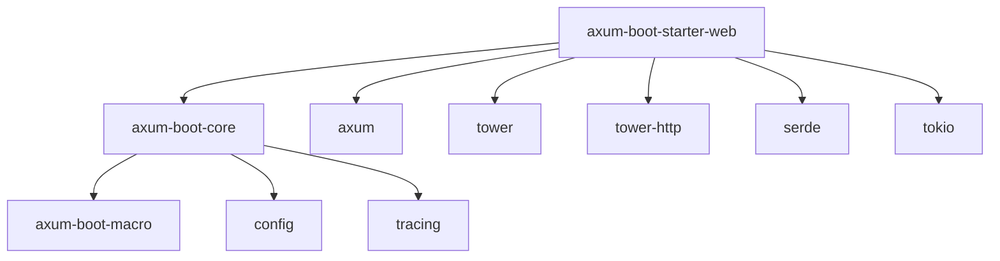

# rspring-web 模块文档

## 📋 概述

`rspring-web` 是 RSpring 框架的 Web 开发启动器模块，提供了快速构建 REST API 的完整解决方案。它基于 Axum 框架，提供了 Spring Boot 风格的注解驱动开发体验。

### 🎯 核心特性

- 🚀 **零配置启动** - 开箱即用的 Web 服务器
- 📝 **注解驱动** - Spring Boot 风格的控制器注解
- 🔄 **自动路由** - 基于注解的自动路由注册
- 📊 **统一响应** - 标准化的 API 响应格式
- 🛡️ **错误处理** - 全局异常处理机制
- 🔧 **中间件支持** - 灵活的中间件配置
- 📈 **监控集成** - 内置健康检查和指标收集

### 📦 快速开始

添加依赖到 `Cargo.toml`：

```toml
[dependencies]
axum-boot-starter-web = "0.1.0"
```

## 🏗️ 架构设计

### 核心组件架构

```
axum-boot-starter-web
├── web/
│   ├── server.rs          # Web 服务器启动和配置
│   ├── router.rs          # 路由管理和注册
│   ├── middleware.rs      # 中间件管理
│   └── response.rs        # 响应处理
├── controller/
│   ├── annotations.rs     # 控制器注解定义
│   ├── mapping.rs         # 路由映射
│   └── extractor.rs       # 请求参数提取
├── error/
│   ├── handler.rs         # 错误处理器
│   └── response.rs        # 错误响应格式
└── lib.rs                 # 模块导出
```

### 模块依赖关系



## 📚 API 参考

### 核心类型

#### WebServerConfig

Web 服务器配置结构体：

```rust
/// Web 服务器配置
#[derive(Debug, Clone, Deserialize)]
pub struct WebServerConfig {
    /// 服务器监听地址
    pub host: String,
    
    /// 服务器端口
    pub port: u16,
    
    /// 最大连接数
    pub max_connections: usize,
    
    /// 请求超时时间（秒）
    pub request_timeout: u64,
    
    /// 静态文件目录
    pub static_dir: Option<String>,
    
    /// CORS 配置
    pub cors: CorsConfig,
}

/// CORS 配置
#[derive(Debug, Clone, Deserialize)]
pub struct CorsConfig {
    /// 允许的来源
    pub allowed_origins: Vec<String>,
    
    /// 允许的方法
    pub allowed_methods: Vec<String>,
    
    /// 允许的头部
    pub allowed_headers: Vec<String>,
    
    /// 是否允许凭证
    pub allow_credentials: bool,
}
```

#### ApiResponse<T>

统一的 API 响应格式：

```rust
/// API 响应包装器
#[derive(Debug, Serialize, Deserialize)]
pub struct ApiResponse<T> {
    /// 响应代码
    pub code: i32,
    
    /// 响应消息
    pub message: String,
    
    /// 响应数据
    pub data: Option<T>,
    
    /// 响应时间戳
    pub timestamp: i64,
}

impl<T> ApiResponse<T> {
    /// 创建成功响应
    pub fn success(data: T) -> Self;
    
    /// 创建成功响应（无数据）
    pub fn success_empty() -> Self;
    
    /// 创建错误响应
    pub fn error(code: i32, message: impl Into<String>) -> Self;
    
    /// 创建业务错误响应
    pub fn business_error(message: impl Into<String>) -> Self;
    
    /// 创建验证错误响应
    pub fn validation_error(message: impl Into<String>) -> Self;
}
```

#### PageResult<T>

分页响应结构体：

```rust
/// 分页结果
#[derive(Debug, Serialize, Deserialize)]
pub struct PageResult<T> {
    /// 数据列表
    pub items: Vec<T>,
    
    /// 总记录数
    pub total: i64,
    
    /// 当前页码
    pub page: i64,
    
    /// 每页大小
    pub size: i64,
    
    /// 总页数
    pub pages: i64,
}

impl<T> PageResult<T> {
    /// 创建分页结果
    pub fn new(items: Vec<T>, total: i64, page: i64, size: i64) -> Self;
    
    /// 创建空分页结果
    pub fn empty(page: i64, size: i64) -> Self;
}
```

### 注解系统

#### @RestController

标记类为 REST 控制器：

```rust
/// REST 控制器注解
/// 
/// # 示例
/// ```rust
/// #[derive(RestController)]
/// pub struct UserController {
///     user_service: Arc<UserService>,
/// }
/// ```
#[proc_macro_derive(RestController, attributes(RequestMapping))]
pub fn rest_controller_derive(input: TokenStream) -> TokenStream;
```

#### @RequestMapping

定义控制器的基础路由：

```rust
/// 请求映射注解
/// 
/// # 参数
/// - `path`: 路由路径
/// - `method`: HTTP 方法（可选）
/// 
/// # 示例
/// ```rust
/// #[derive(RestController)]
/// #[RequestMapping("/api/users")]
/// pub struct UserController;
/// ```
#[attribute]
pub struct RequestMapping {
    pub path: String,
    pub method: Option<String>,
}
```

#### HTTP 方法注解

```rust
/// GET 请求映射
/// 
/// # 示例
/// ```rust
/// #[GetMapping("/{id}")]
/// pub async fn get_user(&self, #[PathVariable] id: u64) -> Result<ApiResponse<User>>;
/// ```
#[attribute]
pub struct GetMapping(pub String);

/// POST 请求映射
#[attribute] 
pub struct PostMapping(pub String);

/// PUT 请求映射
#[attribute]
pub struct PutMapping(pub String);

/// DELETE 请求映射
#[attribute]
pub struct DeleteMapping(pub String);

/// PATCH 请求映射
#[attribute]
pub struct PatchMapping(pub String);
```

#### 参数提取注解

```rust
/// 路径变量注解
/// 
/// # 示例
/// ```rust
/// pub async fn get_user(&self, #[PathVariable] id: u64) -> Result<ApiResponse<User>>;
/// pub async fn get_user_post(&self, 
///     #[PathVariable("user_id")] id: u64, 
///     #[PathVariable("post_id")] post_id: u64
/// ) -> Result<ApiResponse<Post>>;
/// ```
#[attribute]
pub struct PathVariable(pub Option<String>);

/// 请求体注解
/// 
/// # 示例
/// ```rust
/// pub async fn create_user(&self, #[RequestBody] request: CreateUserRequest) -> Result<ApiResponse<User>>;
/// ```
#[attribute]
pub struct RequestBody;

/// 查询参数注解
/// 
/// # 示例
/// ```rust
/// pub async fn list_users(&self, #[RequestParam] page: Option<u64>) -> Result<ApiResponse<Vec<User>>>;
/// ```
#[attribute]
pub struct RequestParam(pub Option<String>);

/// 请求头注解
/// 
/// # 示例
/// ```rust
/// pub async fn get_user(&self, #[RequestHeader("Authorization")] token: String) -> Result<ApiResponse<User>>;
/// ```
#[attribute]
pub struct RequestHeader(pub String);
```

### 中间件系统

#### 内置中间件

```rust
/// CORS 中间件
pub struct CorsMiddleware {
    config: CorsConfig,
}

impl CorsMiddleware {
    pub fn new(config: CorsConfig) -> Self;
    pub fn permissive() -> Self;  // 开发模式，允许所有来源
}

/// 日志中间件
pub struct LoggingMiddleware;

impl LoggingMiddleware {
    pub fn new() -> Self;
}

/// 请求 ID 中间件
pub struct RequestIdMiddleware;

impl RequestIdMiddleware {
    pub fn new() -> Self;
}

/// 超时中间件
pub struct TimeoutMiddleware {
    timeout: Duration,
}

impl TimeoutMiddleware {
    pub fn new(timeout: Duration) -> Self;
}
```

#### 自定义中间件

```rust
/// 中间件 trait
#[async_trait]
pub trait Middleware: Send + Sync + 'static {
    /// 处理请求
    async fn handle(
        &self,
        request: Request<Body>,
        next: Next<Body>,
    ) -> Result<Response<Body>, Error>;
}

/// 中间件注册器
pub struct MiddlewareRegistry {
    middlewares: Vec<Box<dyn Middleware>>,
}

impl MiddlewareRegistry {
    /// 添加中间件
    pub fn add<M: Middleware>(&mut self, middleware: M);
    
    /// 应用中间件到 Axum 应用
    pub fn apply_to_app(&self, app: Router) -> Router;
}
```

## 🚀 使用指南

### 基础使用

#### 1. 创建控制器

```rust
use axum_boot_starter_web::*;
use serde::{Deserialize, Serialize};

/// 用户模型
#[derive(Debug, Serialize, Deserialize)]
pub struct User {
    pub id: u64,
    pub name: String,
    pub email: String,
}

/// 创建用户请求
#[derive(Debug, Deserialize)]
pub struct CreateUserRequest {
    pub name: String,
    pub email: String,
}

/// 用户控制器
#[derive(RestController)]
#[RequestMapping("/api/users")]
pub struct UserController {
    user_service: Arc<UserService>,
}

impl UserController {
    /// 获取用户列表
    #[GetMapping]
    pub async fn list_users(
        &self,
        #[RequestParam] page: Option<u64>,
        #[RequestParam] size: Option<u64>,
    ) -> Result<ApiResponse<PageResult<User>>> {
        let page = page.unwrap_or(1);
        let size = size.unwrap_or(10);
        
        let result = self.user_service.list_users(page, size).await?;
        Ok(ApiResponse::success(result))
    }
    
    /// 根据 ID 获取用户
    #[GetMapping("/{id}")]
    pub async fn get_user(
        &self,
        #[PathVariable] id: u64,
    ) -> Result<ApiResponse<User>> {
        let user = self.user_service.get_user(id).await?;
        Ok(ApiResponse::success(user))
    }
    
    /// 创建用户
    #[PostMapping]
    pub async fn create_user(
        &self,
        #[RequestBody] request: CreateUserRequest,
    ) -> Result<ApiResponse<User>> {
        let user = self.user_service.create_user(request).await?;
        Ok(ApiResponse::success(user))
    }
    
    /// 更新用户
    #[PutMapping("/{id}")]
    pub async fn update_user(
        &self,
        #[PathVariable] id: u64,
        #[RequestBody] request: CreateUserRequest,
    ) -> Result<ApiResponse<User>> {
        let user = self.user_service.update_user(id, request).await?;
        Ok(ApiResponse::success(user))
    }
    
    /// 删除用户
    #[DeleteMapping("/{id}")]
    pub async fn delete_user(
        &self,
        #[PathVariable] id: u64,
    ) -> Result<ApiResponse<()>> {
        self.user_service.delete_user(id).await?;
        Ok(ApiResponse::success_empty())
    }
}
```

#### 2. 配置 Web 服务器

```toml
# application.toml
[server]
host = "0.0.0.0"
port = 8080
max_connections = 1000
request_timeout = 30

[server.cors]
allowed_origins = ["http://localhost:3000", "https://myapp.com"]
allowed_methods = ["GET", "POST", "PUT", "DELETE"]
allowed_headers = ["Content-Type", "Authorization"]
allow_credentials = true

[server.static]
dir = "static"
mount_path = "/static"
```

#### 3. 启动应用

```rust
use axum_boot_core::*;
use axum_boot_starter_web::*;

#[axum_boot_application]
pub struct Application;

#[tokio::main]
async fn main() -> Result<()> {
    Application::run().await
}
```

### 高级功能

#### 1. 自定义错误处理

```rust
/// 业务异常
#[derive(Debug, thiserror::Error)]
pub enum BusinessError {
    #[error("用户不存在")]
    UserNotFound,
    
    #[error("邮箱已存在")]
    EmailExists,
    
    #[error("权限不足")]
    AccessDenied,
}

/// 全局错误处理器
#[derive(Component)]
pub struct GlobalErrorHandler;

#[async_trait]
impl ErrorHandler for GlobalErrorHandler {
    async fn handle_error(&self, error: &Error) -> ApiResponse<()> {
        match error {
            Error::Business(BusinessError::UserNotFound) => {
                ApiResponse::error(404, "用户不存在")
            },
            Error::Business(BusinessError::EmailExists) => {
                ApiResponse::error(409, "邮箱已存在")
            },
            Error::Validation(msg) => {
                ApiResponse::validation_error(msg)
            },
            _ => {
                tracing::error!("未处理的错误: {}", error);
                ApiResponse::error(500, "内部服务器错误")
            }
        }
    }
}
```

#### 2. 请求验证

```rust
use validator::{Validate, ValidationError};

/// 创建用户请求（带验证）
#[derive(Debug, Deserialize, Validate)]
pub struct CreateUserRequest {
    #[validate(length(min = 2, max = 50, message = "用户名长度必须在2-50个字符之间"))]
    pub name: String,
    
    #[validate(email(message = "邮箱格式不正确"))]
    pub email: String,
    
    #[validate(length(min = 6, message = "密码至少6个字符"))]
    pub password: String,
}

impl UserController {
    #[PostMapping]
    pub async fn create_user(
        &self,
        #[RequestBody] #[Validated] request: CreateUserRequest,
    ) -> Result<ApiResponse<User>> {
        // 请求会自动验证，验证失败返回 400 错误
        let user = self.user_service.create_user(request).await?;
        Ok(ApiResponse::success(user))
    }
}
```

#### 3. 自定义中间件

```rust
/// 认证中间件
pub struct AuthMiddleware {
    jwt_secret: String,
}

impl AuthMiddleware {
    pub fn new(jwt_secret: String) -> Self {
        Self { jwt_secret }
    }
}

#[async_trait]
impl Middleware for AuthMiddleware {
    async fn handle(
        &self,
        mut request: Request<Body>,
        next: Next<Body>,
    ) -> Result<Response<Body>, Error> {
        // 获取 Authorization 头
        let auth_header = request
            .headers()
            .get("Authorization")
            .and_then(|h| h.to_str().ok());
            
        if let Some(auth_header) = auth_header {
            if let Some(token) = auth_header.strip_prefix("Bearer ") {
                // 验证 JWT token
                match self.verify_token(token) {
                    Ok(user_id) => {
                        // 将用户 ID 存储到请求扩展中
                        request.extensions_mut().insert(UserId(user_id));
                        return Ok(next.run(request).await?);
                    },
                    Err(_) => {
                        return Ok(Response::builder()
                            .status(401)
                            .body(Body::from("无效的令牌"))?);
                    }
                }
            }
        }
        
        Ok(Response::builder()
            .status(401)
            .body(Body::from("需要认证"))?)
    }
    
    fn verify_token(&self, token: &str) -> Result<u64, Error> {
        // JWT 验证逻辑
        // 返回用户 ID
        Ok(1001)
    }
}

/// 使用认证中间件
#[derive(Component)]
pub struct MiddlewareConfig {
    auth_middleware: AuthMiddleware,
}

impl MiddlewareConfig {
    pub fn configure(&self, registry: &mut MiddlewareRegistry) {
        registry.add(self.auth_middleware.clone());
    }
}
```

#### 4. 文件上传

```rust
use axum::extract::Multipart;

impl UserController {
    /// 上传用户头像
    #[PostMapping("/{id}/avatar")]
    pub async fn upload_avatar(
        &self,
        #[PathVariable] id: u64,
        mut multipart: Multipart,
    ) -> Result<ApiResponse<String>> {
        while let Some(field) = multipart.next_field().await? {
            let name = field.name().unwrap_or("");
            
            if name == "avatar" {
                let data = field.bytes().await?;
                let file_name = format!("avatar_{}.jpg", id);
                
                // 保存文件
                tokio::fs::write(format!("uploads/{}", file_name), data).await?;
                
                // 更新用户头像 URL
                let avatar_url = format!("/uploads/{}", file_name);
                self.user_service.update_avatar(id, avatar_url.clone()).await?;
                
                return Ok(ApiResponse::success(avatar_url));
            }
        }
        
        Err(Error::validation("未找到头像文件"))
    }
}
```

## 🔧 配置参考

### 完整配置示例

```toml
# application.toml

[server]
# 服务器基础配置
host = "0.0.0.0"
port = 8080
max_connections = 1000
request_timeout = 30

# 静态文件配置
[server.static]
enabled = true
dir = "static"
mount_path = "/static"
cache_max_age = 86400

# CORS 配置
[server.cors]
enabled = true
allowed_origins = ["*"]
allowed_methods = ["GET", "POST", "PUT", "DELETE", "OPTIONS"]
allowed_headers = ["*"]
allow_credentials = false
max_age = 86400

# 压缩配置
[server.compression]
enabled = true
level = 6
min_size = 1024

# SSL/TLS 配置
[server.tls]
enabled = false
cert_path = "cert.pem"
key_path = "key.pem"

# 速率限制
[server.rate_limit]
enabled = true
requests_per_minute = 1000
burst_size = 100

# 健康检查
[server.health]
enabled = true
path = "/health"
detailed = false

# 监控配置
[server.metrics]
enabled = true
path = "/metrics"
```

### 环境变量配置

```bash
# 服务器配置
SERVER_HOST=0.0.0.0
SERVER_PORT=8080
SERVER_MAX_CONNECTIONS=1000

# CORS 配置
SERVER_CORS_ENABLED=true
SERVER_CORS_ALLOWED_ORIGINS="http://localhost:3000,https://myapp.com"

# TLS 配置
SERVER_TLS_ENABLED=false
SERVER_TLS_CERT_PATH=cert.pem
SERVER_TLS_KEY_PATH=key.pem
```

## 🧪 测试支持

### 单元测试

```rust
#[cfg(test)]
mod tests {
    use super::*;
    use axum_boot_starter_web::test::*;
    
    #[tokio::test]
    async fn test_get_user() {
        // 创建测试应用
        let app = create_test_app()
            .await
            .with_controller::<UserController>();
        
        // 发送测试请求
        let response = app
            .get("/api/users/1")
            .send()
            .await
            .unwrap();
        
        // 验证响应
        assert_eq!(response.status(), 200);
        
        let body: ApiResponse<User> = response.json().await.unwrap();
        assert_eq!(body.code, 200);
        assert!(body.data.is_some());
    }
    
    #[tokio::test]
    async fn test_create_user() {
        let app = create_test_app()
            .await
            .with_controller::<UserController>();
        
        let request_body = CreateUserRequest {
            name: "测试用户".to_string(),
            email: "test@example.com".to_string(),
        };
        
        let response = app
            .post("/api/users")
            .json(&request_body)
            .send()
            .await
            .unwrap();
        
        assert_eq!(response.status(), 200);
        
        let body: ApiResponse<User> = response.json().await.unwrap();
        assert_eq!(body.code, 200);
        assert_eq!(body.data.unwrap().name, "测试用户");
    }
}
```

### 集成测试

```rust
#[cfg(test)]
mod integration_tests {
    use super::*;
    use axum_boot_starter_web::test::*;
    
    #[tokio::test]
    async fn test_user_crud_flow() {
        let app = create_test_app().await;
        
        // 1. 创建用户
        let create_request = CreateUserRequest {
            name: "集成测试用户".to_string(),
            email: "integration@example.com".to_string(),
        };
        
        let create_response = app
            .post("/api/users")
            .json(&create_request)
            .send()
            .await
            .unwrap();
        
        assert_eq!(create_response.status(), 200);
        
        let created_user: ApiResponse<User> = create_response.json().await.unwrap();
        let user_id = created_user.data.unwrap().id;
        
        // 2. 获取用户
        let get_response = app
            .get(&format!("/api/users/{}", user_id))
            .send()
            .await
            .unwrap();
        
        assert_eq!(get_response.status(), 200);
        
        // 3. 更新用户
        let update_request = CreateUserRequest {
            name: "更新后的用户".to_string(),
            email: "updated@example.com".to_string(),
        };
        
        let update_response = app
            .put(&format!("/api/users/{}", user_id))
            .json(&update_request)
            .send()
            .await
            .unwrap();
        
        assert_eq!(update_response.status(), 200);
        
        // 4. 删除用户
        let delete_response = app
            .delete(&format!("/api/users/{}", user_id))
            .send()
            .await
            .unwrap();
        
        assert_eq!(delete_response.status(), 200);
    }
}
```

## 🎯 最佳实践

### 1. 控制器设计

```rust
/// ✅ 好的设计：职责单一，方法简洁
#[derive(RestController)]
#[RequestMapping("/api/users")]
pub struct UserController {
    user_service: Arc<UserService>,  // 只依赖业务服务
}

impl UserController {
    /// 方法名清晰，返回类型统一
    #[GetMapping("/{id}")]
    pub async fn get_user(&self, #[PathVariable] id: u64) -> Result<ApiResponse<User>> {
        // 委托给服务层处理业务逻辑
        let user = self.user_service.get_user(id).await?;
        Ok(ApiResponse::success(user))
    }
}

/// ❌ 避免的设计：职责混乱
#[derive(RestController)]
pub struct BadController {
    user_service: Arc<UserService>,
    email_service: Arc<EmailService>,  // 过多依赖
    cache_service: Arc<CacheService>,
    db_pool: Arc<DbPool>,              // 直接依赖数据层
}
```

### 2. 错误处理

```rust
/// ✅ 统一的错误处理
impl UserController {
    #[PostMapping]
    pub async fn create_user(&self, #[RequestBody] request: CreateUserRequest) -> Result<ApiResponse<User>> {
        // 让服务层抛出语义化的错误
        match self.user_service.create_user(request).await {
            Ok(user) => Ok(ApiResponse::success(user)),
            Err(Error::Business { code, message }) => {
                // 业务错误返回 4xx
                Ok(ApiResponse::error(400, format!("{}: {}", code, message)))
            },
            Err(e) => {
                // 系统错误记录日志并返回 5xx
                tracing::error!("创建用户失败: {}", e);
                Ok(ApiResponse::error(500, "内部服务器错误"))
            }
        }
    }
}
```

### 3. 参数验证

```rust
/// ✅ 使用验证注解
#[derive(Debug, Deserialize, Validate)]
pub struct CreateUserRequest {
    #[validate(length(min = 2, max = 50))]
    pub name: String,
    
    #[validate(email)]
    pub email: String,
}

/// ✅ 自定义验证器
#[derive(Debug, Deserialize)]
pub struct UpdateUserRequest {
    pub name: Option<String>,
    pub email: Option<String>,
}

impl UpdateUserRequest {
    /// 业务验证逻辑
    pub fn validate(&self) -> Result<()> {
        if let Some(name) = &self.name {
            if name.trim().is_empty() {
                return Err(Error::validation("用户名不能为空"));
            }
        }
        
        if let Some(email) = &self.email {
            if !email.contains('@') {
                return Err(Error::validation("邮箱格式不正确"));
            }
        }
        
        Ok(())
    }
}
```

### 4. 性能优化

```rust
/// ✅ 异步处理和批量操作
impl UserController {
    #[GetMapping("/batch")]
    pub async fn get_users_batch(
        &self,
        #[RequestParam] ids: String,  // "1,2,3,4,5"
    ) -> Result<ApiResponse<Vec<User>>> {
        // 解析 ID 列表
        let user_ids: Result<Vec<u64>, _> = ids
            .split(',')
            .map(|s| s.trim().parse())
            .collect();
            
        let user_ids = user_ids.map_err(|_| Error::validation("无效的用户ID格式"))?;
        
        // 批量获取（并发处理）
        let users = self.user_service.get_users_batch(user_ids).await?;
        Ok(ApiResponse::success(users))
    }
    
    /// ✅ 流式处理大量数据
    #[GetMapping("/export")]
    pub async fn export_users(&self) -> Result<impl IntoResponse> {
        let stream = self.user_service.get_users_stream().await?;
        
        let body = StreamBody::new(stream.map(|user| {
            // 转换为 CSV 行
            let csv_line = format!("{},{},{}\n", user.id, user.name, user.email);
            Ok::<_, Error>(csv_line.into_bytes().into())
        }));
        
        Ok(Response::builder()
            .header("Content-Type", "text/csv")
            .header("Content-Disposition", "attachment; filename=users.csv")
            .body(body)?)
    }
}
```

## 📋 常见问题

### Q: 如何处理跨域请求？

A: 在配置文件中启用 CORS：

```toml
[server.cors]
enabled = true
allowed_origins = ["http://localhost:3000"]
allowed_methods = ["GET", "POST", "PUT", "DELETE"]
allowed_headers = ["Content-Type", "Authorization"]
allow_credentials = true
```

### Q: 如何实现接口认证？

A: 使用自定义中间件：

```rust
#[derive(Component)]
pub struct AuthMiddleware;

#[async_trait]
impl Middleware for AuthMiddleware {
    async fn handle(&self, request: Request<Body>, next: Next<Body>) -> Result<Response<Body>, Error> {
        // 认证逻辑
        Ok(next.run(request).await?)
    }
}
```

### Q: 如何处理文件上传？

A: 使用 Axum 的 `Multipart` 提取器：

```rust
#[PostMapping("/upload")]
pub async fn upload_file(&self, mut multipart: Multipart) -> Result<ApiResponse<String>> {
    // 文件处理逻辑
}
```

### Q: 如何实现接口版本控制？

A: 通过路由前缀：

```rust
#[derive(RestController)]
#[RequestMapping("/api/v1/users")]
pub struct UserV1Controller;

#[derive(RestController)]
#[RequestMapping("/api/v2/users")]
pub struct UserV2Controller;
```

## 🚀 下一步

- 📚 [核心概念](../guide/core-concepts.md) - 理解框架设计理念
- 🔧 [配置系统](../guide/configuration.md) - 掌握配置管理
- 🗄️ [数据访问](../guide/data-access.md) - 学习数据库操作
- 🛡️ [错误处理](../guide/error-handling.md) - 构建健壮的错误处理