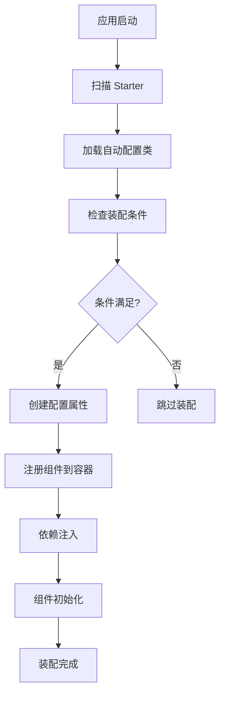

# Starter 开发指南

本指南详细介绍 RSpring 框架中 Starter 的自动装配实现原理以及如何开发自定义 Starter。

## 📋 概述

RSpring 的 Starter 系统借鉴了 Spring Boot 的设计理念，通过**自动装配（Auto Configuration）**机制，让开发者只需添加依赖即可获得完整的功能集成，无需手动配置复杂的组件。

## 🏗️ 自动装配原理

### 核心机制

RSpring 的自动装配基于以下几个核心概念：

1. **条件装配** - 根据条件决定是否装配组件
2. **配置属性绑定** - 自动绑定配置文件到配置结构体
3. **依赖注入** - 自动注入需要的依赖
4. **生命周期管理** - 管理组件的初始化和销毁

### 装配流程



### 实现架构

```rust
// 自动装配特征
pub trait AutoConfiguration: Send + Sync {
    /// 装配条件检查
    fn condition(&self) -> bool { true }
    
    /// 装配组件
    async fn configure(&self, context: &mut ApplicationContext) -> Result<()>;
    
    /// 装配顺序（数字越小优先级越高）
    fn order(&self) -> i32 { 0 }
}

// 条件装配特征
pub trait ConditionalOnProperty {
    fn property_name() -> &'static str;
    fn expected_value() -> Option<&'static str> { None }
    fn match_if_missing() -> bool { false }
}
```

## 🔨 开发自定义 Starter

### 1. 项目结构

创建一个新的 Starter 项目：

```
rspring-starter-custom/
├── Cargo.toml
├── src/
│   ├── lib.rs                 # 主入口
│   ├── config.rs              # 配置结构
│   ├── autoconfigure.rs       # 自动配置
│   ├── service.rs             # 核心服务
│   └── error.rs               # 错误定义
├── templates/                 # 模板文件（如果需要）
└── README.md
```

### 2. Cargo.toml 配置

```toml
[package]
name = "rspring-starter-custom"
version = "0.1.0"
edition = "2021"
description = "RSpring starter for custom functionality"
repository = "https://github.com/hi-liyan/rspring"
license = "MIT"

[dependencies]
# 必须依赖 rspring-core
rspring-core = "0.1.0"

# 其他依赖
tokio = { version = "1.0", features = ["full"] }
serde = { version = "1.0", features = ["derive"] }

# 可选 features
[features]
default = ["async"]
async = ["tokio"]
blocking = []

# 自动装配标记（重要！）
[package.metadata.rspring]
auto-configuration = "rspring_starter_custom::autoconfigure::CustomAutoConfiguration"
```

### 3. 定义配置结构

```rust
// src/config.rs
use rspring_core::*;
use serde::{Deserialize, Serialize};

/// Custom 服务配置
#[derive(Debug, Clone, Deserialize, Serialize)]
pub struct CustomConfig {
    /// 是否启用 Custom 服务
    #[serde(default = "default_enabled")]
    pub enabled: bool,
    
    /// 服务端点 URL
    pub endpoint: Option<String>,
    
    /// API 密钥
    pub api_key: Option<String>,
    
    /// 连接超时（秒）
    #[serde(default = "default_timeout")]
    pub timeout: u64,
    
    /// 最大重试次数
    #[serde(default = "default_max_retries")]
    pub max_retries: u32,
}

impl Default for CustomConfig {
    fn default() -> Self {
        Self {
            enabled: default_enabled(),
            endpoint: None,
            api_key: None,
            timeout: default_timeout(),
            max_retries: default_max_retries(),
        }
    }
}

fn default_enabled() -> bool { true }
fn default_timeout() -> u64 { 30 }
fn default_max_retries() -> u32 { 3 }

/// 配置属性验证
impl CustomConfig {
    pub fn validate(&self) -> Result<()> {
        if self.enabled && self.endpoint.is_none() {
            return Err(Error::validation("custom.endpoint 不能为空"));
        }
        
        if self.timeout == 0 {
            return Err(Error::validation("custom.timeout 必须大于 0"));
        }
        
        Ok(())
    }
}
```

### 4. 实现核心服务

```rust
// src/service.rs
use rspring_core::*;
use std::sync::Arc;

/// Custom 服务客户端
#[derive(Clone)]
pub struct CustomClient {
    config: CustomConfig,
    http_client: reqwest::Client,
}

impl CustomClient {
    pub fn new(config: CustomConfig) -> Result<Self> {
        config.validate()?;
        
        let http_client = reqwest::Client::builder()
            .timeout(Duration::from_secs(config.timeout))
            .build()
            .map_err(|e| Error::internal(format!("创建 HTTP 客户端失败: {}", e)))?;
            
        Ok(Self {
            config,
            http_client,
        })
    }
    
    /// 发送请求到 Custom 服务
    pub async fn send_request(&self, data: serde_json::Value) -> Result<serde_json::Value> {
        let endpoint = self.config.endpoint.as_ref()
            .ok_or_else(|| Error::internal("Custom endpoint 未配置"))?;
            
        let mut attempt = 0;
        
        while attempt <= self.config.max_retries {
            let response = self.http_client
                .post(endpoint)
                .header("Authorization", format!("Bearer {}", 
                    self.config.api_key.as_deref().unwrap_or("")))
                .json(&data)
                .send()
                .await;
                
            match response {
                Ok(resp) if resp.status().is_success() => {
                    return resp.json().await
                        .map_err(|e| Error::internal(format!("解析响应失败: {}", e)));
                }
                Ok(resp) => {
                    let status = resp.status();
                    let text = resp.text().await.unwrap_or_default();
                    
                    if attempt >= self.config.max_retries {
                        return Err(Error::internal(format!(
                            "请求失败: {} - {}", status, text
                        )));
                    }
                }
                Err(e) => {
                    if attempt >= self.config.max_retries {
                        return Err(Error::internal(format!("请求错误: {}", e)));
                    }
                }
            }
            
            attempt += 1;
            tokio::time::sleep(Duration::from_secs(1 << attempt)).await;
        }
        
        unreachable!()
    }
}

/// Custom 服务高级封装
#[derive(Component)]
pub struct CustomService {
    client: Arc<CustomClient>,
}

impl CustomService {
    pub fn new(client: Arc<CustomClient>) -> Self {
        Self { client }
    }
    
    /// 处理业务数据
    pub async fn process_data(&self, data: impl Serialize) -> Result<ProcessResult> {
        let json_data = serde_json::to_value(data)
            .map_err(|e| Error::internal(format!("序列化数据失败: {}", e)))?;
            
        let response = self.client.send_request(json_data).await?;
        
        serde_json::from_value(response)
            .map_err(|e| Error::internal(format!("反序列化响应失败: {}", e)))
    }
}

#[derive(Debug, Deserialize)]
pub struct ProcessResult {
    pub success: bool,
    pub message: String,
    pub data: Option<serde_json::Value>,
}
```

### 5. 实现自动配置

```rust
// src/autoconfigure.rs
use rspring_core::*;
use crate::{CustomConfig, CustomClient, CustomService};
use std::sync::Arc;

/// Custom Starter 自动配置
pub struct CustomAutoConfiguration;

#[async_trait::async_trait]
impl AutoConfiguration for CustomAutoConfiguration {
    /// 装配条件：检查是否启用 custom 功能
    fn condition(&self, context: &ApplicationContext) -> bool {
        // 检查配置是否启用
        let config_manager = context.config_manager();
        
        // 检查是否有相关配置
        if !config_manager.contains_key("custom.enabled") {
            return false;
        }
        
        // 检查是否启用
        config_manager.get::<bool>("custom.enabled").unwrap_or(false)
    }
    
    /// 执行自动装配
    async fn configure(&self, context: &mut ApplicationContext) -> Result<()> {
        tracing::info!("开始装配 Custom Starter...");
        
        // 1. 加载配置
        let config = self.load_config(context)?;
        tracing::debug!("Custom 配置: {:?}", config);
        
        // 2. 验证配置
        config.validate()?;
        
        // 3. 创建客户端
        let client = Arc::new(CustomClient::new(config)?);
        tracing::debug!("Custom 客户端创建成功");
        
        // 4. 注册到容器
        context.register_singleton(client.clone()).await;
        
        // 5. 创建高级服务
        let service = CustomService::new(client);
        context.register_singleton(service).await;
        
        tracing::info!("Custom Starter 装配完成");
        Ok(())
    }
    
    /// 装配顺序
    fn order(&self) -> i32 {
        100  // 较低优先级，在核心组件之后装配
    }
}

impl CustomAutoConfiguration {
    fn load_config(&self, context: &ApplicationContext) -> Result<CustomConfig> {
        let config_manager = context.config_manager();
        
        // 尝试加载完整的 custom 配置节
        match config_manager.get_section::<CustomConfig>("custom") {
            Ok(config) => Ok(config),
            Err(_) => {
                // 如果没有配置节，使用默认配置
                let mut config = CustomConfig::default();
                
                // 但检查是否有启用标志
                if let Ok(enabled) = config_manager.get::<bool>("custom.enabled") {
                    config.enabled = enabled;
                }
                
                Ok(config)
            }
        }
    }
}

/// 条件装配实现
impl ConditionalOnProperty for CustomAutoConfiguration {
    fn property_name() -> &'static str {
        "custom.enabled"
    }
    
    fn expected_value() -> Option<&'static str> {
        Some("true")
    }
    
    fn match_if_missing() -> bool {
        false
    }
}
```

### 6. 主入口文件

```rust
// src/lib.rs
pub mod autoconfigure;
pub mod config;
pub mod service;
pub mod error;

// 重新导出核心功能
pub use rspring_core::*;

// 导出本模块的公共API
pub use autoconfigure::CustomAutoConfiguration;
pub use config::CustomConfig;
pub use service::{CustomClient, CustomService, ProcessResult};

// 重新导出常用的外部类型
pub use reqwest;
pub use serde_json;

/// Starter 初始化函数
/// 
/// 在 rspring-core 中会自动调用此函数
pub fn init() -> Result<Box<dyn AutoConfiguration>> {
    Ok(Box::new(CustomAutoConfiguration))
}

#[cfg(test)]
mod tests {
    use super::*;
    
    #[tokio::test]
    async fn test_auto_configuration() {
        // 测试自动配置逻辑
        let context = ApplicationContext::new().unwrap();
        let auto_config = CustomAutoConfiguration;
        
        // 这里可以测试条件检查、配置加载等
    }
}
```

## 🎯 装配条件

### 内置条件注解

RSpring 提供了多种条件装配机制：

```rust
/// 基于属性值的条件装配
#[derive(ConditionOnProperty)]
#[condition(name = "custom.enabled", having_value = "true")]
pub struct CustomAutoConfiguration;

/// 基于类存在的条件装配
#[derive(ConditionOnClass)]
#[condition(class = "reqwest::Client")]
pub struct HttpClientAutoConfiguration;

/// 基于Bean存在的条件装配
#[derive(ConditionOnBean)]
#[condition(bean_type = "DatabasePool")]
pub struct RepositoryAutoConfiguration;

/// 基于Bean不存在的条件装配
#[derive(ConditionOnMissingBean)]
#[condition(bean_type = "CustomClient")]
pub struct DefaultCustomClientAutoConfiguration;
```

### 自定义条件

```rust
pub struct CustomCondition {
    required_env_var: String,
}

impl Condition for CustomCondition {
    fn matches(&self, context: &ApplicationContext) -> bool {
        std::env::var(&self.required_env_var).is_ok()
    }
}
```

## ⚙️ 配置处理

### 配置绑定

```rust
// 应用配置文件
// application.toml
[custom]
enabled = true
endpoint = "https://api.example.com"
api_key = "your-api-key"
timeout = 30
max_retries = 3

[custom.advanced]
pool_size = 10
keep_alive = true
```

### 配置验证

```rust
impl CustomConfig {
    pub fn validate(&self) -> Result<()> {
        if self.enabled && self.endpoint.is_none() {
            return Err(Error::validation("custom.endpoint 不能为空"));
        }
        
        if let Some(endpoint) = &self.endpoint {
            if !endpoint.starts_with("http") {
                return Err(Error::validation("custom.endpoint 必须是有效的 URL"));
            }
        }
        
        Ok(())
    }
}
```

### 环境变量覆盖

RSpring 自动支持环境变量覆盖配置：

```bash
# 环境变量会覆盖配置文件
export RSPRING_CUSTOM_ENABLED=true
export RSPRING_CUSTOM_ENDPOINT="https://prod-api.example.com"
export RSPRING_CUSTOM_API_KEY="prod-api-key"
```

## 🧪 测试 Starter

### 单元测试

```rust
#[cfg(test)]
mod tests {
    use super::*;
    use rspring_core::test_utils::*;
    
    #[tokio::test]
    async fn test_auto_configuration_with_valid_config() {
        let mut context = TestApplicationContext::new()
            .with_config(r#"
                [custom]
                enabled = true
                endpoint = "https://test.example.com"
                api_key = "test-key"
            "#).await.unwrap();
            
        let auto_config = CustomAutoConfiguration;
        assert!(auto_config.condition(&context));
        
        auto_config.configure(&mut context).await.unwrap();
        
        // 验证组件是否注册
        let client = context.get::<Arc<CustomClient>>().unwrap();
        assert!(client.is_some());
        
        let service = context.get::<CustomService>().unwrap();
        assert!(service.is_some());
    }
    
    #[tokio::test]
    async fn test_auto_configuration_disabled() {
        let context = TestApplicationContext::new()
            .with_config(r#"
                [custom]
                enabled = false
            "#).await.unwrap();
            
        let auto_config = CustomAutoConfiguration;
        assert!(!auto_config.condition(&context));
    }
    
    #[tokio::test]
    async fn test_config_validation() {
        let config = CustomConfig {
            enabled: true,
            endpoint: None,  // 应该触发验证错误
            ..Default::default()
        };
        
        assert!(config.validate().is_err());
    }
}
```

### 集成测试

```rust
#[cfg(test)]
mod integration_tests {
    use super::*;
    
    #[tokio::test]
    async fn test_full_application_with_custom_starter() {
        #[rspring_application]
        struct TestApp;
        
        // 使用测试配置
        std::env::set_var("RSPRING_CUSTOM_ENABLED", "true");
        std::env::set_var("RSPRING_CUSTOM_ENDPOINT", "https://httpbin.org/post");
        
        let app = RSpringApplication::new().unwrap();
        let context = app.context();
        
        // 获取自动装配的服务
        let custom_service = context.get::<CustomService>().unwrap();
        
        // 测试服务功能
        let result = custom_service.process_data(json!({
            "test": "data"
        })).await;
        
        assert!(result.is_ok());
    }
}
```

## 📦 发布 Starter

### 1. 完善文档

- README.md 包含使用说明
- API 文档完整
- 示例代码清晰

### 2. 版本管理

```toml
[package]
version = "0.1.0"  # 遵循语义化版本
```

### 3. 发布到 crates.io

```bash
cargo publish
```

### 4. 使用 Starter

用户只需在 `Cargo.toml` 中添加依赖：

```toml
[dependencies]
rspring-starter-custom = "0.1.0"
```

然后在配置文件中启用：

```toml
[custom]
enabled = true
endpoint = "https://api.example.com"
api_key = "your-api-key"
```

## 🚀 最佳实践

### 1. 命名规范

- Starter 包名：`rspring-starter-{功能}`
- 配置前缀：与功能名相关，如 `custom`, `mail`, `redis`
- 类名：`{功能名}AutoConfiguration`

### 2. 配置设计

- 提供合理的默认值
- 支持环境变量覆盖
- 配置验证要完整
- 配置结构要清晰

### 3. 错误处理

- 提供清晰的错误信息
- 配置错误要早期发现
- 支持优雅降级

### 4. 文档完善

- 提供完整的使用示例
- 说明配置选项
- 包含常见问题解答

### 5. 测试覆盖

- 单元测试覆盖核心逻辑
- 集成测试验证自动装配
- 配置各种场景的测试

通过遵循这些原则和实践，你可以开发出高质量、易用的 RSpring Starter，为 RSpring 生态系统贡献力量！